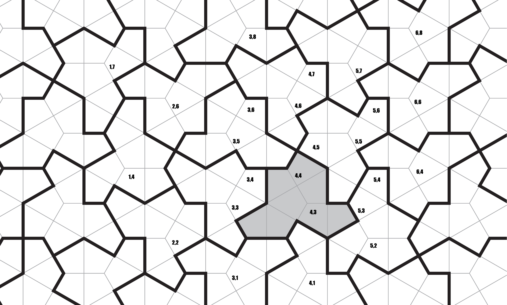

#  einstein

V članku Smith, David; Myers, Joseph Samuel; Kaplan, Craig S.; Goodman-Strauss, Chaim: [An aperiodic monotile](https://escholarship.org/uc/item/3317z9z9). Combinatorial Theory (2024) Volume 4, Issue 1, #6 je bil opisan tlakovec "**einstein**".
21. in 22. maja 2026 sem v logu razvil podporo za opis prikazov tlakovanj s prikazom na zaslonu pa tudi opisom v Postscriptu in SVG.

 

  - [Logo2PS](logo2ps.lgo)
  - [Logo2Svg](Logo2Svg.lgo)
  - [Logo2VRML](LogoVRML.lgo)
  - [Ferdinand in Logo](Ferdinand+Logo.zip)
   

[logo](../README.md)

