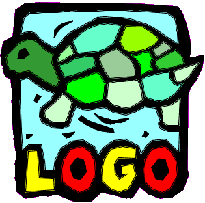

#  Info

  - [FMSlogo](https://sourceforge.net/projects/fmslogo); [manual](https://fmslogo.sourceforge.io/manual/);  [WS](https://fmslogo.sourceforge.io/workshop/)
  - [Netlogo](https://www.netlogo.org/)
  - [Logo / RRT](http://www.educa.fmf.uni-lj.si/logo/si/RRT/default.htm)
  - [Brian Harvey](https://people.eecs.berkeley.edu/~bh/)
  - [Logo tree](https://www.scribd.com/document/472198248/Logo-Tree-Project)
  - [Logo Foundation](https://el.media.mit.edu/logo-foundation/index.html)
  - Cynthia Solomon: [Logo Things](https://logothings.github.io/logothings/Home.html)
  - [LCSI](http://www.microworlds.com/support/logo-philosophy-papert.html)
  - [Scheme](https://groups.csail.mit.edu/mac/projects/scheme/)
  - [Scratch](https://scratch.mit.edu/)

[logo](./README.md)

